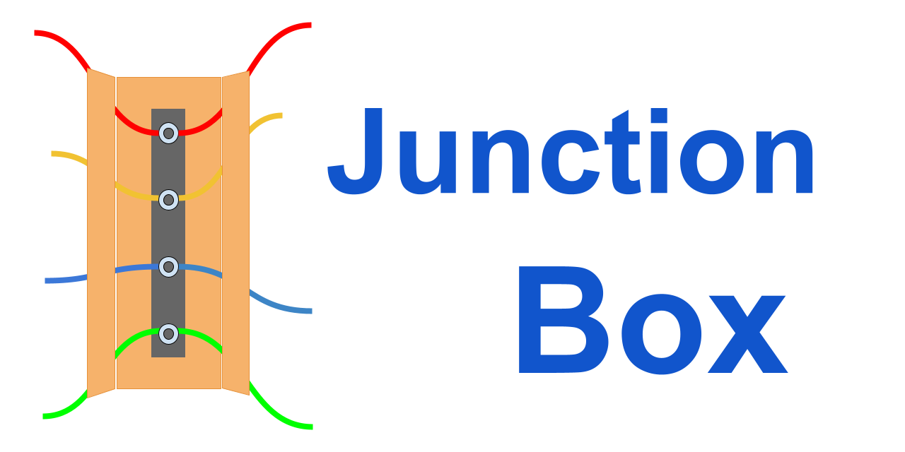

================
**Junction Box**
================

|

|

|made-with-sphinx-doc|

.. |made-with-sphinx-doc| image:: https://img.shields.io/badge/Made%20with-Sphinx-1f425f.svg
   :target: https://www.sphinx-doc.org/

.. image:: https://www.repostatus.org/badges/latest/active.svg
   :alt: Project Status: Active – The project has reached a stable, usable state and is being actively developed.
   :target: https://www.repostatus.org/#active

.. image:: https://readthedocs.org/projects/junction-box/badge/?version=latest
   :target: https://junction-box.readthedocs.io/en/latest/?badge=latest
   :alt: Documentation Status

.. image:: https://pyup.io/repos/github/imAsparky/junction-box/shield.svg
     :target: https://pyup.io/repos/github/imAsparky/junction-box/
     :alt: Updates

.. image:: https://img.shields.io/badge/pre--commit-enabled-brightgreen?logo=pre-commit&logoColor=white
   :target: https://github.com/pre-commit/pre-commit
   :alt: pre-commit

.. image:: https://img.shields.io/badge/code%20style-black-000000.svg
    :target: https://github.com/ambv/black
    :alt: Code style: black

|

A junction box is a place for making connections.
-------------------------------------------------
|

*Here, we document connections between technologies for our software development framework.*

|

Would you mind providing feedback or creating a discussion on our GitHub
`discussion board <https://github.com/imAsparky/junction-box/discussions>`__?

|

Junction Box documentation `here <https://junction-box.readthedocs.io/>`__.

|

Technologies
------------

Here is the list of our chosen technologies where documentation is under active
development and will be available when complete.

#. `Traefik <https://traefik.io/>`__ Cloud-Native networking stack that just works.

#. `Docker <https://www.docker.com/>`__ Accelerate how you build, share, and
    run modern applications.

#. `Django <https://www.djangoproject.com/>`__` makes it easier to build better
   web apps more quickly and with less code.

|

Documentation
-------------

* `Diátaxis <https://diataxis.fr/>`__ is the documentation framework employed.
  Diátaxis adopts a systematic approach to structuring technical documentation.

      See an excellent presentation at `Pycon Melbourne 2017
      <https://youtu.be/t4vKPhjcMZg>`__  by the creator of Diátaxis
      Daniele Procida.

|

* `Sphinx <https://www.sphinx-doc.org/en/master/>`__, created for the Python
  language, provides excellent facilities for documenting projects using
  various languages.  This project uses
  `reStructuredText <https://docutils.sourceforge.io/rst.html>`__.

|

* `Templates
  <https://junction-box.readthedocs.io/en/stable/Document-Templates/template-index.html>`__
  have been added to get documentation up and running fast.  More templates are
  under development.

* `Semantic Versioning`  has been added. See the
  `CHANGELOG <https://junction-box.readthedocs.io/en/stable/CHANGELOG.html>`__
  for all the latest updates.

**MORE TO COME!**
